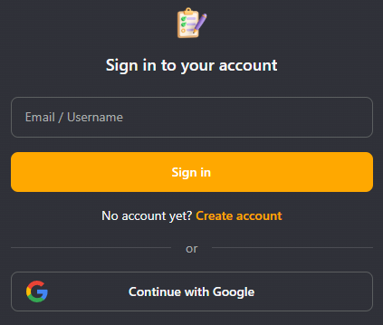

# Procrasti-Not

    
     
    
    
    
    
    
     
     

Procrasti Not is a simple todo list application built with SvelteKit. It stores data in a MongoDB cluster and includes user authentication, todo management, AI-powered text correction, and theme customization.

## ✨ Features

- User authentication via [Logto.io](https://docs.logto.io/introduction), with Google sign-in support.
- Add, complete, and delete todos.
- Add random todos using the [DummyJson](https://dummyjson.com/docs/todos) API.
- Correct typos in custom todos with the [Gemini](https://ai.google.dev/gemini-api/docs) API.
- Switch between themes: _Light_, _Alpine_, _Dark_, and _Cyberpunk_.

## 🖼️ Screenshots & Demo

### Login

Log in using Logto.io or Google authentication.

    

### Theme Switching

Switch between included themes.

    

### Managing Todos

Add random todos, mark tasks as completed, or delete them.

    

### Custom Todo with AI Correction

Add custom todos and use AI to correct typos.

    

---

    <a href="https://github.com/imAlessas"> <samp> @imAlessas </samp> </a>

